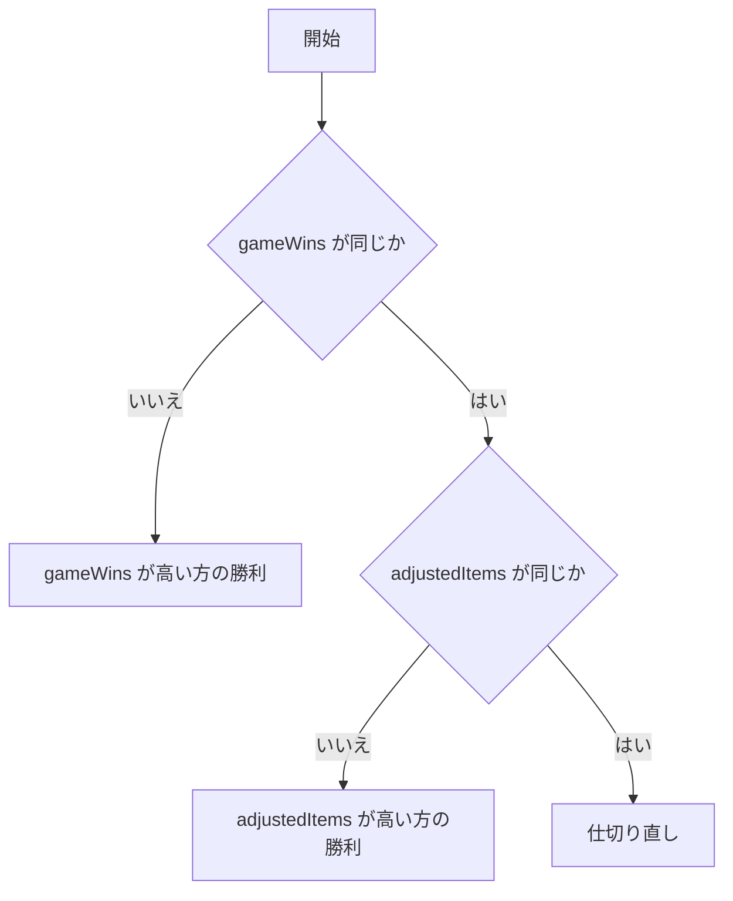

# CHroS 技術要件

> 将来検討用の旧設計。2026-09-18の依頼者の補足により、現在の対象は対人戦の記録・集計・掲示をつなぐ試作に絞った。
> Bot戦、ノード式エディター、PostgreSQLなど本書の全項目を実装したわけではない。
> 現在の実装仕様は [technical-requirements.md](./technical-requirements.md)、自主判断は [prototype-proposal.md](./prototype-proposal.md) を優先する。

対象読者: CHroS の実装者。要件そのものは [requirements.md](./requirements.md) を参照。

このドキュメントは、既存実装（Next.js + Express/socket.io + FastAPI の3サービス構成）を
ゼロベースで再設計した結果を定める。既存コードとの差分は末尾の「現行構成からの移行」に記す。

2026-09-18追記: 釧路を主対象とし、旭川・北海道系と全国交流大会への拡張を整理した。
出典・確認版・未確認事項は [大会ルール調査](./tournament-rules.md) を参照。
以下は設計であり、既存コードの実装完了を示すものではない。

## 1. 決定事項サマリ

| 項目 | 決定 | 理由 |
| --- | --- | --- |
| 言語 | TypeScript に統一 | フロントが存在する以上 TS は必須。型を共有パッケージで持てば境界のズレが消える |
| 構成 | pnpm workspace による monorepo、アプリは Next.js 単体 | サービス分割のコストに見合う独立性が現時点で無い。統合の逆は容易だが分割の巻き戻しは高くつく |
| サーバー → Viewer 通信 | **SSE**（WebSocket は採用しない） | Viewer は受信専用。双方向性が要らないなら SSE の方が単純で、HTTP のまま扱える |
| DB | PostgreSQL | 変更なし |
| ORM | Prisma | 変更なし |
| スコア計算 | **ノードグラフで定義し JSON として永続化**、評価器は TS | 計算式を非エンジニアが編集できることが本システムの核（§5） |
| 計算式の保存先 | PostgreSQL の `jsonb` | 形が変わりうるデータを構造化のまま持て、検索も効く |
| 認証・権限 | **設けない** | 会場 LAN 内でのみ動かす前提。意図的な決定であり、未検討ではない（§1.3） |
| 対象大会 | **釧路を優先**し、旭川・北海道系、全国交流大会へ拡張 | 開催年度・ステージ別の規則プロファイルで差分を持つ（§4.1） |
| 判定の入力 | 終了原因・残りターン・審判裁定を区別 | Put負け、自滅、タイムアウトを一律の `blocked` にすると実規則を再現できない |

### 1.1 なぜ WebSocket をやめるのか

当初は WebSocket を前提にしていたが、通信要件を洗うと以下だった。

- Console → サーバー: 通常の HTTP リクエスト（スコア入力、画面切替）で足りる
- サーバー → Viewer: 一方向のプッシュのみ。Viewer からの送信は無い

双方向のフレームが必要な箇所が無いため、SSE で要件を満たす。SSE を選ぶ利点は具体的に、

- 再接続とイベント ID による取りこぼし復帰がプロトコル標準（`Last-Event-ID`）で提供される
- 素の HTTP なので、リバースプロキシ・Next.js の Route Handler にそのまま載る
- socket.io / 別プロセスの WS サーバーが不要になり、サービスが1つ減る

将来 Viewer 側から入力を受ける要件（観客投票など）が出た場合のみ WebSocket を再検討する。

### 1.2 なぜ計算式をコードで書かせないのか

釧路大会は他大会と比べてスコア計算が複雑であり、大会ごとに規則も変わる。
これをアプリのコードに埋め込むと、規則が変わるたびにエンジニアの改修が必要になる。
そこで**計算式をデータとして外部から与えられる**構造を、本システムの中核に据える。

当初案は Lua または Python の式を外部入力として取り込み評価する方式だった。これは撤回する。

- 触ってほしい相手は非エンジニアであり、どんな言語であってもコードを書かせるのは負担が大きい
- 任意コード評価はサンドボックス・実行時間・例外の扱いを自前で抱えることになる
- 別言語ランタイムを持ち込むと TS 統一の利点（型共有）が計算式の境界で切れる

代わりに、**ノードを繋いで計算を組み立てる方式**（Scratch 的な編集 UI）を採る。
実体は JSON のグラフであり、`jsonb` に格納して TS の評価器で解釈する。
これにより、編集 UI・保存形式・評価器のすべてが型を共有した1つの TS 世界に収まる。

一方で Rume の指摘どおり、ノード方式であっても「任意の式が組める」ことを目指すと結局複雑になる。
**用意するノードの語彙は大会規則の実例から決める**（§5.8 未決事項）。
表現力は後から足せるが、一度公開した保存形式は減らせないため、初版は狭く始める。

### 1.3 認証を設けない判断

Console にログインを設けない。運営が触れる端末は会場 LAN 内にあり、
外部から到達できないネットワークで運用することを前提とする。

この判断が成立する条件を明記しておく。**満たせなくなった時点で再検討が必要**である。

- アプリを会場 LAN の外に公開しない（インターネット経由での運営操作を行わない）
- 配信用の Viewer も同じ LAN 内のブラウザから開く
- 大会後にシステムを稼働させたまま記録公開に使う場合は、
  **Console への到達を塞ぐか、そこで初めて認証を導入する**（§11）

したがって、Console と Viewer をネットワーク的に分離する必要はないが、
**Viewer 側の画面から Console へ遷移できる導線は置かない**（配信事故を避けるため）。

## 2. リポジトリ構成

```
CHaserProgressionControlSystem/
├── chros/                      # Next.js (App Router) — Console / Viewer / API を内包
│   ├── app/
│   │   ├── console/            # 運営向け操作画面
│   │   ├── display/            # 配信用 Viewer 画面
│   │   └── api/                # Route Handlers (REST + SSE)
│   └── prisma/
│       ├── schema.prisma
│       └── migrations/
├── packages/
│   ├── shared/                 # ドメイン型・イベント定義・Zod スキーマ（DB 非依存）
│   └── scoring/                # スコア計算・順位計算の純粋ロジック
├── docs/
├── docker-compose.yaml
└── pnpm-workspace.yaml
```

方針:

- `packages/shared` と `packages/scoring` は**副作用と I/O を持たない**。DB・HTTP・React に依存しない。
  こうしておくと、後で API を別プロセスに切り出す判断をしたときに、そのまま持ち出せる。
- Next.js アプリの中では Console / Viewer / API がディレクトリで分かれているだけであり、
  依存の向きは `chros/** → packages/**` の一方向に限る。

### 2.1 `apps/` を設けない理由

当初は `apps/chros/` として monorepo の慣例どおり app 階層を設ける案だったが、これは採らない。
この階層が要るのは**別々にデプロイされる成果物が複数ある**場合であり、CHroS では該当しないため。

想定していた同居先はいずれも別リポジトリで管理する。

| 想定 | 扱い |
| --- | --- |
| 大会後の記録公開（§11.3） | 別リポジトリ |
| CHaServer の隣に常駐するログ取り込み（§11.3） | 別リポジトリ |

ノードエディタ UI（§5.8）や自動抽選は工数こそ大きいが、いずれも運営が Console で触る画面であり、
`chros/app/console/**` の一部にすぎない。**機能の独立性や工数はデプロイ単位を分ける理由にならない。**

一方 `packages/` は app が1つでも残す。別リポジトリへ持ち出す際にそのまま動くことに加え、
`package.json` に next / react / prisma を持たせないことで、
上記の「副作用と I/O を持たない」制約がレビューではなくビルドで守られるため。

## 3. 技術スタック

### 3.1 共通

| 項目 | 採用 |
| --- | --- |
| パッケージマネージャ | pnpm (workspace) |
| Node.js | 22 LTS |
| TypeScript | 5.x, `strict: true`, `noUncheckedIndexedAccess: true` |
| バリデーション | Zod（API 入出力・SSE ペイロードの単一の真実） |
| Lint / Format | ESLint (flat config) + Prettier |
| テスト | Vitest（`packages/scoring` は必須、API は主要経路） |

### 3.2 フロントエンド

| 項目 | 採用 |
| --- | --- |
| フレームワーク | Next.js 15 (App Router) |
| React | 19 |
| スタイル | Tailwind CSS v4 |
| Console のデータ取得 | Server Components + Server Actions を基本とする |
| Viewer のデータ取得 | SSE (`EventSource`) による push のみ |

Console は「操作して結果が返る」画面なので Server Actions と再検証で足りる。
Viewer は「状態に追従する」画面なので SSE。この2つを混ぜない。

### 3.3 バックエンド

| 項目 | 採用 |
| --- | --- |
| API | Next.js Route Handlers (`app/api/**`) |
| DB | PostgreSQL 17 |
| ORM | Prisma 6 |
| リアルタイム | SSE (`text/event-stream`) |

Python (FastAPI, lupa) は廃止し、スコア計算は `packages/scoring` に TS で実装する。
CHaser のログ解析が必要になった場合も TS のパーサとして同パッケージ内に置く。

## 4. ドメインモデル

既存スキーマを土台に、進行状態と大会のステージを持たせる。
`Match` は試合、`Score` はその中の1対戦の事実を指す。
以下は主要フィールドの設計スケッチであり、逆参照や一部の型・制約を省略している。
そのまま実行するPrismaスキーマではない。

```prisma
enum Side       { COOL, HOT }
enum MatchState { PENDING, IN_PROGRESS, REVIEW_REQUIRED, FINISHED }

model Tournament {
  id           Int      @id @default(autoincrement())
  name         String
  edition      String            // 開催年度・開催回
  stages       Stage[]
  entries      Participant[]
}

model Stage {
  id            Int    @id @default(autoincrement())
  tournamentId  Int
  order         Int
  name          String           // 予選、決勝など
  format        Format           // BOT_QUALIFYING | ROUND_ROBIN | SINGLE_ELIMINATION
  ruleProfileId Int              // 対戦構成・裁定・計算・順位・マップ設定の確定版
  matches       Match[]

  @@unique([tournamentId, order])
}

model RuleProfile {
  id              Int      @id @default(autoincrement())
  name            String
  version         Int
  sourceReferences Json    // URL、改訂日／版／commit／hash、条項、確認日
  gamePlan        Json     // 対戦回数、COOL/HOT割り当て、同一マップ条件
  gameOutcomePolicy Json   // 終了事象から対戦勝敗を決める条件・優先順
  replayPolicy    Json     // 自動再試合／裁定待ち、無効範囲、新マップ等
  rankingPolicy   Json?    // 順位・組ごとの通過者・同点処理。未確認ならnull
  mapPolicy       Json     // 寸法、ターン範囲、公開方針、使用サーバー版等
  scoreRuleId     Int?     // トラックAでは未設定可。本採点には検証済み版が必要
  confirmedAt     DateTime? // 対象大会への適用条件を確認した日時

  @@unique([name, version])
}

/// スコア計算規則。graph にノードグラフの JSON を持つ。
/// 一度大会で使用した規則は書き換えず、新しい version を作る（§5.7）。
model ScoreRule {
  id          Int      @id @default(autoincrement())
  name        String
  version     Int
  graph       Json                  // jsonb。ScoreGraph 型（packages/shared）
  publishedAt DateTime?             // 検証を通過し使用可能になった時刻
  createdAt   DateTime @default(now())

  @@unique([name, version])
}

model Participant {
  id           Int    @id @default(autoincrement())
  tournamentId Int
  name         String
  kind         ParticipantKind   // COMPETITOR | BOT。BOTは選手順位の対象外
  // 対戦・スコアへの逆参照
}

model Match {
  id           Int         @id @default(autoincrement())
  stageId      Int
  groupId      Int?                 // グループ予選なら所属グループ
  order        Int                  // ステージ内の対戦枠。再試合でも同じ値
  attempt      Int         @default(1)
  rematchOfId  Int?
  ruleProfileId Int                 // この試行に適用した版を固定
  state        MatchState  @default(PENDING)
  agent1Id     Int
  agent2Id     Int
  firstCoolId  Int?                 // じゃんけん等で確定した初戦の先攻
  sideAssignmentMethod String?     // JANKEN | FIXED_BY_RULE | MANUAL
  scores       Score[]
  results      MatchResult[]        // 再計算・裁定の履歴を保持
  activeResultId Int?               // 採用中の結果。変更を履歴に残す

  @@unique([stageId, order, attempt])
}

/// 対戦の生データ。計算結果ではなく「観測された事実」のみを持つ。
/// 事実と裁定から得点算出ブロックの「入力の箱」を構成する（§5.4）。
model Score {
  id            Int   @id @default(autoincrement())
  matchId       Int
  gameNumber    Int               // 1から。1対戦のみのBot戦に後半を作らない
  coolId        Int
  hotId         Int
  mapVersionId  Int               // マップの識別子と版。内容の公開とは別
  turnLimit     Int
  coolItems     Int?              // 生の取得個数。中断等で未確認ならnull
  hotItems      Int?
  remainingTurns Int?            // 秒ではない。未確認と0を区別する
  endFacts      Json             // 終了事象の種別・行為者・影響を受けた側
  inputRevision Int              // 訂正前の事実は別履歴に残す

  @@unique([matchId, gameNumber])
}

// 対戦単位／試合単位の裁定は別の追記型履歴として保持する。
// 対象ID、事実の版、適用プロファイル、採用する終了原因、対戦勝者、
// 再試合／有効／裁定待ち、理由、裁定者の記録名、日時を持つ（§4.2）。

/// 計算規則を Score に適用した結果。どの規則で出したかを必ず添える。
model MatchResult {
  id           Int      @id @default(autoincrement())
  matchId      Int
  revision     Int
  ruleProfileId Int     // 採点以外の条件も含む適用版
  scoreRuleId  Int?     // 採点前の無効化・裁定だけならnull
  inputRefs    Json     // 入力・裁定の版を固定して参照
  outcome      Outcome // WIN | DRAW | REPLAY | VOID
  agent1Output Json?    // 出力スロット名 -> 値。採点しない結果ならnull
  agent2Output Json?
  winnerId     Int?
  winReason    String?  // 決め手のスロット／適用条項と裁定理由
  trace        Json?    // 評価の中間値と通過した制御経路（§5.6 検証・説明用）
  computedAt   DateTime @default(now())

  @@unique([matchId, revision])
}
```

追加・変更の意図:

- `Tournament` / `Stage`: 大会と予選・決勝を分離する。同一大会内でBot予選と対人戦の規則が変わる。
- `StageGroup` / `GroupEntry`（上のスケッチでは省略）: グループの所属ステージと参加者を持つ。
  グループ予選では同じ組の選手同士だけを対戦させ、順位・通過者を組単位で確定する。
  通常の総当たり予選はグループなしでも表せる。組数やグループ化する人数の閾値は固定しない。
- `Match.order` / `Match.state`: 「今どの対戦をやっているか」を DB の状態として持つ。
  Viewer の表示はこの状態から導出され、画面切替のためだけの独立した状態を持たない。
- `Score.endFacts`: **終了原因を潰さず保存し、意味付けを規則に委ねる**。
  旭川の相手Put負けは比較値0、自滅負けは負の残りターンとなり、釧路のタイムアウトは再試合に
  なるため、従来案の `blocked: Side?` への統合は撤回する（§4.2、§5.4）。
- `MatchResult.winReason`: 「どのような勝ち方をしたか」の表示要件（得点表示）に直接対応する。
  現行は `put` / `lostConnect` から表示側が推論する必要があり、ロジックが散る。
  値は enum ではなく文字列とする。勝因は規則側の終端ノード構成で決まるため、
  システム側で列挙し切れない。
- `MatchResult.agent*Output` を `Json` にする理由: **何を得点として外に出すかは規則が決める**（§5.3）。
  予選得点1つの規則もあれば勝利数と補正アイテム数を出す規則もあるため、固定カラムにできない。
  表示側は出力スロットの定義（名前・表示名・型）を規則から引いて描画する。
- `Score` と `MatchResult` の分離: **入力された事実と、規則を適用した結果を混ぜない**。
  規則が変わったとき、事実はそのままに結果だけ再計算できる。可搬性を掲げる以上ここは譲れない。

事実は先に保存できる。裁定と必要な入力が揃った時点で `packages/scoring` を実行し、
結果を `MatchResult` に永続化する。表示のたびに再計算しない。

### 4.1 大会別・ステージ別の規則プロファイル

公式資料の比較は [大会ルール調査 §2–5](./tournament-rules.md) による。
`RuleProfile` は実行コードではなく検証可能なデータとし、次を一緒に固定する。

- 資料の出典と版、対象の開催回、追加細則、未確認項目と確認記録。
- 対戦構成: 初版は1対戦または先後交代2対戦。対戦ごとのマップ、Botの側を明示する。
  釧路はじゃんけんで決まった初戦のCOOL/HOTを保存し、2戦目は同じ選手の側を反転する。
- 対戦勝敗・再試合の条件表と優先順、試合の採点グラフ、順位と通過者決定の設定。
- マップ・運用条件: 寸法、ターン上限と偶数制約、応答制限時間、公開時点、サーバー版。
  マップ自動生成やクライアント実行はCHroSの初版には含めない。

釧路を最初の運用対象とするが、未確認の集計方法を初期値で埋めない。
旭川ではBot予選と決勝で別プロファイルを使う。全国交流大会は詳細細則を確認するまで草案とする。
規則の技術的検証と、運営による適用条件の確認は別に記録し、自動採点に必要な未確認事項が
残るプロファイルは公開不可とする。トラックAの入力・表示・裁定記録は未公開でも実装できる。

釧路のステージ構成は、依頼者（元実行委員長、2026-09-18）の現行運用説明を根拠に、
`ROUND_ROBIN` の予選と `SINGLE_ELIMINATION` の本戦を基本とする。
グループ予選を選んだ場合は組ごとに総当たりを組み、各組上位2名を通過対象とする。
順位規則、同順位処理、通常予選の通過人数、本戦の配置方法は別の設定・確認事項。
公式サイトの「予選なし」との相違は [調査資料U1・§3.3](./tournament-rules.md) に記録した。

初戦の先後が未確定なら開始不可とする。じゃんけんの勝者からCOOLを推定するのでなく、
確定したCOOLの参加者IDを入力し、相手をHOTとする。記録するIDはその試合の参加者に限る。
Bot戦はプロファイルから割り当て、じゃんけん入力を要求しない。
再試合は別試行なので、先後を引き継ぐか決め直すかも確定してから開始する。
各対戦のCOOL/HOTは試合の2参加者と一致し、先後交代モードでは必ず反転することを検証する。
グループと試合が同じステージに属し、両参加者がそのグループに登録済みであることも検証する。

### 4.2 終了事象・裁定・無効化

記録すべき事象は、規定ターン終了、直接Put、相手による封鎖、自分による封鎖、
ブロックへの移動、場外移動、クライアント異常終了、応答タイムアウト、通信エラー、
サーバー障害、審判が認定したその他の異常。行為者・影響を受けた側・元の観測情報を持つ。
**同時成立を保存できる配列**とし、勝敗はその配列に適用するプロファイルと裁定から求める。

自分による封鎖と相手による封鎖は、旭川の減点に必要なため別事象にする。
原因不明の通信断を自動で選手の責任とせず、`REVIEW_REQUIRED` へ送る。
釧路の直接Put優先と、旭川のPutによる同時成立時の勝利優先も条件表に明記する。

裁定履歴は原記録を編集せず追記し、理由・裁定者の記録名・日時・対象範囲・適用条項を残す。
認証機能は追加しないため記録名は本人認証を意味しない。
訂正・再計算・無効化で採用結果が変わったら、順位と勝ち上がりへの影響を示し、
既に開始した後続試合がある場合は進行を保留して運営が処理を確定する。

旧データの `put` / `lostConnect` だけでは新しい終了原因を復元できない場合がある。
推定で自滅や封鎖に変換せず、旧版での結果と元データを残し、再計算には原因の補完を要する。

## 5. スコア計算エンジン

本システムの核。大会ごとに異なる複雑な計算規則を、エンジニアの改修なしに差し替えられるようにする
（動機は §1.2）。

### 5.1 全体像

```
[Console: ノードエディタ] --(ScoreGraph JSON)--> [検証器] --> [ScoreRule テーブル(jsonb)]
                                                                     |
                        [Score(事実)] ------> [評価器 evaluate()] <---+
                                                     |
                                                     v
                                            [MatchResult(結果 + trace)]
```

すべて `packages/scoring` に置く。**I/O も DB も React も参照しない純粋な TS** とし、
評価器・検証器・型定義を1か所にまとめる。これにより計算規則の単体テストが容易になり、
将来 CLI や別サービスから同じ規則を再利用できる。

評価器の前段で、`RuleProfile` の条件表と裁定履歴から対戦の有効性・勝者・終了分類を
確定する。再試合条件に該当すれば採点せず `REPLAY`、判断や入力が不足すれば
`REVIEW_REQUIRED` とする。これは大会名で分岐する処理ではなく、版を持つ条件データの適用である。
条件表も純粋関数として検証・評価し、規則に一致しない事象を黙って敗北へ変換しない。

### 5.2 用語

「ブロック」「演算子」「ノード」が混ざると議論が滑るため、以下に固定する。

| 用語 | 指すもの | 例 |
| --- | --- | --- |
| **ブロック** | 編集単位。ユーザーが追加・削除できない固定の区画 | 得点算出ブロック、勝敗判定ブロック |
| **ノード** | ブロック内に置く処理の1単位。ユーザーが自由に配置する | 加算ノード、同値判定ノード |
| **ポート** | ノードの入出力の接続口。名前と型を持つ | `left` / `right` / `yes` / `no` |
| **値エッジ** | 数値・真偽値を運ぶ線。得点算出ブロックのみ | 加算ノード → 出力スロット |
| **制御エッジ** | 「次にどのノードへ進むか」を運ぶ線。勝敗判定ブロックのみ | 同値判定の `no` → 終端ノード |

以降、ユーザーが「演算子」と呼んでいたものは**ノード**と呼ぶ。

### 5.3 グラフの表現

対人の試合勝敗を求めるグラフは、**2種類・3ブロック**の構造を持つ。
ブロックの単位は**参加者**であり、COOL/HOT の側ではない（理由は後述）。

```
┌─ 得点算出ブロック (参加者A) ─┐  ┌─ 得点算出ブロック (参加者B) ─┐
│ 入力: A の対戦データ         │  │ 入力: B の対戦データ         │
│   前半 COOL として / 後半 HOT│  │   前半 HOT として / 後半 COOL│
│ 演算ノード群                 │  │ 演算ノード群                 │
│ 出力: 数値 (A の得点)        │  │ 出力: 数値 (B の得点)        │
└──────────────┬───────────────┘  └──────────────┬───────────────┘
               │                                 │
               └────────────────┬────────────────┘
                                v
              ┌─ 勝敗判定ブロック (1つ) ──────────────┐
              │ 入力: 両者の得点                      │
              │ if ノードを主体とした比較             │
              │ 出力: 勝者 (A / B / DRAW) + 勝因      │
              └───────────────────────────────────────┘
```

**得点算出ブロックの定義は1つだけ持ち、評価時に両参加者へ適用する。**
2ブロックに見えるのは評価時の姿であり、編集対象は1つ。
両者に同じ規則が当たることを構造で保証でき、「片方だけ直し忘れて不公平になる」バグが起きない。
先攻/後攻による差はブロックを分けるのではなく、入力（前半/後半、COOL/HOT）を参照して
ブロック内の分岐として表現する。

上図は先後交代2対戦の例。Bot予選は1対戦の得点算出と順位への出力で足り、
相手Botの換算得点と比較して試合勝敗を決めるブロックを付けない。
対戦勝敗は前段の裁定結果を用いる。`purpose` と `inputShape` で両者を区別する。

この分割が持つ意味:

- **「何点になるか」と「どちらが勝ちか」を混ぜない。** 得点算出ブロックは数値を出すことだけに責任を持ち、
  勝敗の概念を知らない。勝敗判定ブロックは得点の作り方を知らない。
  規則変更の多くは片方だけの修正で済む。
- 得点算出ブロックは**片側ぶんの入力しか受け取れない**。相手の得点を参照できないため、
  「相手より1点多ければ」のような比較は構造上ここに書けず、必ず勝敗判定ブロックに寄る。
  この制約が、規則の置き場所の曖昧さを消す。
- 勝敗判定ブロックの出力は勝者と勝因のみ。得点をここで書き換えることはできない。

```ts
export type ScoreRuleGraph = {
  formatVersion: 1;               // 保存形式の版。移行判定に使う
  inputShape: 'single' | 'swap-pair';
  points: PointsBlock;            // 同じ定義を参加者ごとに適用
} & (
  | { purpose: 'match-decision'; decision: DecisionBlock }
  | { purpose: 'ranking-score'; rankingSlot: string }
);

/** 得点算出ブロック: 値エッジのみの純粋な式。複数の値を名前付きで外に出す */
export type PointsBlock = {
  nodes: PointsNode[];
  valueEdges: ValueEdge[];
  outputs: OutputSlot[];          // 1つ以上。名前は勝敗判定ブロックから参照される
};

export type OutputSlot = {
  name: string;                   // 例: 'qualifyingScore' / 'gameWins' / 'adjustedItems'
  label: string;                  // 表示名（Console・配信画面で使う）
  type: 'number' | 'boolean';
  from: NodeId;                   // この値を出すノード
  fromPort: string;
};

/**
 * 勝敗判定ブロック: 制御エッジのみのフローチャート。
 * 値は線で運ばず、各ノードが「どの出力スロットを見るか」を属性として持つ。
 */
export type DecisionBlock = {
  nodes: DecisionNode[];          // 分岐ノード | 終端ノード
  controlEdges: ControlEdge[];    // 進行先を運ぶ。値は持たない
  entry: NodeId;                  // 制御の開始点。ちょうど1つ
};

export type DecisionNode =
  | { id: NodeId; kind: 'branch.equal';    slot: string } // 数値スロットが同値か
  | { id: NodeId; kind: 'branch.flag';     slot: string } // 真偽スロットで分岐
  | { id: NodeId; kind: 'terminal.higher'; slot: string } // 高い方の勝利
  | { id: NodeId; kind: 'terminal.rematch' }              // 仕切り直し（再戦）
  | { id: NodeId; kind: 'terminal.draw' };                // 引き分け

type ValueEdge   = { from: NodeId; fromPort: string; to: NodeId; toPort: string };
type ControlEdge = { from: NodeId; branch: 'yes' | 'no'; to: NodeId };
```

`slot` は得点算出ブロックの出力スロット名であり、**両参加者の同名スロットを対象とする**。
`a.score` と `b.score` を個別に繋ぐのではなく、「`score` を比較する」と1つ選ぶ。

ブロックごとに使えるノードの語彙を変える。全ブロック共通の語彙は持たない。

**得点算出ブロック**（初版の想定。確定は §5.8）

| 分類 | 例 | 備考 |
| --- | --- | --- |
| 入力 | §5.4 の入力の箱 | 相手の**出力スロット**は参照できない（§5.4） |
| 演算 | 加減乗除、`min` / `max` | |
| 条件 | `if`（条件・真の値・偽の値の3入力） | 先攻/後攻で差をつけたい場合はここで分岐 |
| 定数 | 数値・真偽値 | 非エンジニアが調整する主な対象 |
| 出力 | **出力スロット**。数値または真偽値を、名前を付けて1つ以上 | 下記 |

入力は参加者視点の `games[0]` / `games[1]` とする。
`swap-pair` では `asCool` / `asHot` の別名も使えるが、`single` には存在しない。
存在しない後半を0で補わず、規則の `inputShape` に合わない参照を構造検証で弾く。

**出力は1つの数値に固定しない。何をいくつ外に出すかを規則の作成者が決める。**
これは大会ごとの差を吸収するために必要な自由度である。

- 旭川Bot予選 → `qualifyingScore` を出す
- 旭川の対人戦 → `gameWins` と `adjustedItems` を出す（§5.5）
- 釧路 → 自滅等・Put・アイテムの分類を分離した出力を用意する。集計式は運営確認後に確定する

出力スロットは名前と型を持ち、勝敗判定ブロックの各ノードが名前で1つ選択する（両参加者の同名スロットが対象）。
出力スロットの追加・削除・改名は、それを参照している勝敗判定ブロックを壊すため、検証で検出する（§5.6）。

**勝敗判定ブロック**

このブロックだけは式ではなく**フローチャート**である。
制御エッジをたどって進み、終端ノードに到達した時点で勝敗が確定して評価が終わる。

**各ノードは「どのスコアを見るか」を選択として持ち、値は線で運ばない。**
得点算出ブロックの出力スロットが選択肢として並び、その中から1つ選ぶ。

| 種別 | ノード | 見るもの | 制御出力 | 意味 |
| --- | --- | --- | --- | --- |
| 分岐 | **同値判定** | 数値スロット1つ | `yes` / `no` | 両者のそのスコアが等しいかで進む先を分ける |
| 分岐 | **フラグ判定** | 真偽スロット1つ | `yes` / `no` | 真偽の要因で進む先を分ける |
| 終端 | **高い方の勝利** | 数値スロット1つ | なし | そのスコアが大きい側を勝者として確定する |
| 終端 | **仕切り直し** | なし | なし | 勝敗を付けず、同一カードの再戦とする |
| 終端 | **引き分け** | なし | なし | 引き分けとして確定する |

**「仕切り直し」は引き分けとは別物**であり、両者を区別して持つ。
釧路の試合と旭川の対人戦（§5.5）は、規定の比較でも決まらなければ再試合となる。
これはBot戦の同点時処理を定めるものではない。引き分け終端は対応を明示したプロファイルだけで
使い、未確認の同点を引き分け確定に置き換えない。

- **終端ノードは制御出力を持たない。** これが「確定して終わる」ことの表現であり、
  出力が無いこと自体が意味を担う。終端に到達したら以降のノードは評価しない。
- **分岐ノードは値を出力しない。** 真偽値を後段に配って使い回すのではなく、
  制御の行き先そのものを分ける。真偽値が線として漂わないので、
  「この true はどこで使われるのか」を読み解く必要がない。
- **このブロックに値エッジは存在しない。線は制御エッジ1種類だけである。**
  スロットの選択がその役割を果たす。これにより得られるものが3つある。
  - **編集が「線を2種類引き分ける」から「ドロップダウンで選ぶ」に落ちる。**
    非エンジニアに触らせるという目的に対して、UI の難所が1つ消える。
  - **無意味な接続が原理的に作れない。** 値エッジがあると
    「A の `gameWins` と B の `adjustedItems` を比べる」という非対称で無意味な繋ぎ方が書けてしまう。
    スロットを1つ選ぶ形なら、比較は常に両参加者の同名スロット同士になる。
    §5.3 冒頭で述べた**規則の対称性が、判定ブロック側でも構造として保証される**。
  - 型検証が「線の型整合」ではなく「選んだスロットの型がノードの要求と合うか」に単純化される。
    ドロップダウンに合う型のスロットだけを並べれば、誤りは選択肢として存在しなくなる。

値エッジを持つのは得点算出ブロックだけになる。§5.2 の用語表では2種類の線を定義しているが、
**1つのブロックが両方の線を持つことはない**。

#### 判定の優先順位はフローの順序そのもの

「補正アイテム数より対戦勝利数を先に比較する」旭川の対人戦（§5.5）は、
優先度という別概念を導入せず、**制御エッジを繋ぐ順序**で表現する。
先に置いた分岐が先に評価される。



線は制御エッジ1種類だけであり、各ノードの中に「見るスコア」の選択が入っている。
釧路の比較順も同値判定を連ねる形で表現できるが、比較する値の算出方法を先に確定する必要がある。
Bot予選の順位付けはこの対人勝敗フローを使わず、ステージの `rankingPolicy` が担当する。

同じ語彙のまま、分岐を置く順を入れ替えるだけで「得点が先、要因が後」の大会にも対応できる。
**優先順位を数値やフィールドで持たない**ため、順序が図として一目で読めるという利点がある。

**勝因（`WinReason`）は、どの終端ノードに到達したかそのものである。**
別途フィールドとして組み立てる必要はなく、終端ノードの種別と、
そこに繋がれていた出力スロット名（例: `gameWins` で決着）を記録すれば足りる。
これは trace（§5.6）とも自然に一致する。
採点前に再試合・失格等の裁定で決めた場合は、終端ノードの代わりに条件表の条項と裁定理由を記録する。

ここで A / B は `Match.agent1` / `agent2` を指す。
評価器は結果を実際の `Participant.id` に解決してから `MatchResult` に書く。

制御フローを持つのは勝敗判定ブロックだけであり、得点算出ブロックには制御エッジを定義しない。
得点算出は常に全ノードを評価して出力スロットを埋める純粋な式のままとする。

制約として、

- **ループ構造を持たない。値エッジ・制御エッジのどちらについても、である。**
  ノードの再帰参照と後方への辺を検証器で弾き、両方のグラフを DAG に限る。
  制御エッジを導入するとフローチャートになり「戻る線」を引きたくなるが、これを許した瞬間に
  下記の保証がすべて失われるため、明示的に禁止する。
  これは意図的にチューリング完全性を捨てる設計判断であり、見返りとして次を無条件に得る。
  - **停止性が構造的に保証される。** 実行時間の監視、タイムアウト、無限ループの検出が不要になる。
  - **状態を持たない。** 評価は入力から出力への写像であり、途中経過が観測に影響しない。
    そのため任意の順で評価しても、途中で打ち切って再開しても結果が同じになる。
  - **静的に全ノードの値域と型を追える。** 検証（§5.6）が実行なしで完結し、
    エディタ上で「繋いだ瞬間に誤りが分かる」形にできる。
  - **trace が常に有限で全ノードぶん取れる。** 説明可能性（§5.6）がここに依存する。
- ブロック間の接続は固定であり、ユーザーが編集できるのは各ブロックの内側だけ。
  ブロックを跨ぐ辺、ブロックの追加・削除はできない。
- ノードの種別は列挙型であり、任意の関数呼び出しやコード片は持てない。
- 評価は純粋。乱数・現在時刻・外部参照を持つノードを定義しない
  （抽選など乱数が要る機能はスコア計算とは別系統で扱う。§5.8）。

対人試合の評価順序は `points`(参加者A) → `points`(参加者B) → `decision` に固定する。
前2つは同一の定義を異なる入力で評価するだけで相互に依存しないため、
順序を入れ替えても結果は変わらない（上記の無状態性による）。

これにより**規則の対称性が構造的に保証される**。
「A に有利な式が紛れ込んでいないか」を検証する必要が無く、
非対称性は勝敗判定ブロックに書かれた場合にのみ発生しうるので、レビュー範囲がそこに限定される。
Bot予選は `points` の指定スロットを順位計算へ渡す。試合の採点結果には前段で確定した
対戦勝者と参加者の得点を残し、Botを順位対象から除くのはステージ側の責務とする。

### 5.4 入力の箱

得点算出ブロックが参照できる入力を「箱」として定義する。
箱は**参加者1人ぶんの、1試合ぶんの事実**を表す。

初版で用意する箱（`games[n].` の下に置く。以下は自分の1対戦ぶんの一覧）:

| 箱 | 型 | 内容 |
| --- | --- | --- |
| `items` | number | 生の取得アイテム数。補正値で上書きしない |
| `remainingTurns` | number | 終了時の残りターン数。`remainingTime`（秒）とは分ける |
| `selfWon` / `selfLost` | boolean | 終了事象と適用規則・裁定から確定した対戦勝敗 |
| `lostByOpponentPut` | boolean | 相手の直接Putによる敗北として確定 |
| `lostByOpponentEnclosure` | boolean | 相手からの封鎖による敗北として確定 |
| `lostBySelfBlockMove` / `lostBySelfEnclosure` | boolean | 自滅の種類を区別した敗北 |
| `lostByOutOfBounds` | boolean | 自らの場外移動による敗北として確定 |
| `lostByClientCrash` / `lostByCommunicationError` | boolean | 異常終了と責任の確定した通信エラーによる敗北 |
| `lostByAdjudicatedClientFault` | boolean | その他の異常を裁定で敗北扱いとしたもの |
| `opponentLostBy…` | boolean | 上記と同じ分類を相手側について参照 |
| `isCool` | boolean | この対戦で自分がCOOLだったか |

これらは原記録を上書きするフィールドではなく、§4.2の事実と版を固定した裁定から作る
**評価用の入力ビュー**である。失格・再試合・裁定待ちは前段で扱い、`selfLost` へ押し込まない。
直接Putと自分の封鎖の同時成立では、観測事象は両方残し、敗因の箱には勝利優先を適用した
最終分類を入れる。未確定の勝敗をfalse／falseとして採点に進めない。

`remainingTurns` は整数かつ `0 <= remainingTurns <= turnLimit`、アイテム数は非負整数とする。
補正後の値は負数を許容する。未実施の対戦と未入力値は0に変換しない。
規定ターン終了時の勝敗など、規則から決まる値と入力した裁定に矛盾があれば確認を求める。
タイムアウトと通信エラーは別事象であり、釧路のタイムアウトをこの表の敗北へ自動変換しない。

#### 相手の事実は参照してよい

§5.3 で「得点算出ブロックは自分の値のみを参照できる」と述べたが、正確には次のとおり。

- **参照できない**: 相手の**出力スロット**（相手の算出済み得点）。
  これを許すと得点算出が相互参照になり、対称性の保証とブロック分割の意味が失われる。
- **参照してよい**: 相手についての**事実と確定済みの終了分類**（`opponentLostByClientCrash` など）。
  釧路では相手の自滅等による勝利とPut勝ちを区別するため、相手の終了原因も必要になる。

境界は「観測・裁定に基づく入力か、相手の算出済みスコアか」であり、「自分か、相手か」ではない。

#### 箱を増やすことの重さ

箱を増やす場合は元の事実・裁定の保存方法と入力スキーマを更新し、
互換性のない変更は `formatVersion` を上げる。
**箱は後から足せるが、一度公開した箱は減らせない。**

なお「アイテム数×3 + 残りターン数」のような合成は箱としては持たない。
それは得点算出ブロックで組み立てるものであり（§5.5 のBot予選）、
箱の側で合成してしまうと規則を差し替えられるという前提が崩れる。

### 5.5 規則の実例

2026-09-18に公開資料を照合し、従来の匿名の「大会A／大会B」の例を置き換えた。
以前の「特殊ポイント1種類」と「全大会で前後半の `items×3 ± remainingTime` を合算する」
という説明は、対象大会の実規則を表していない。
出典と数値付きの受け入れ例は [大会ルール調査 §3–6](./tournament-rules.md) にまとめる。

#### 釧路 — 終了分類の優先順と再試合

公開細則§1-3の比較順は **相手の自滅等による勝利 → Put勝ち → アイテム数優勢**。
各分類を別スロットにし、同値なら次のスロットへ進む構造は採用できる。
ただし、前後半を集計する具体式は運営確認後に確定する。
分類ごとの勝利回数を合計する案や重み付けの係数を、公式に確定した仕様として実装しない。

公開細則§1-4の再試合条件は、このスロット比較より先に判定する。
応答タイムアウトやサーバー障害なら再試合、審判判断が必要なら裁定待ちとなり、
採点対象になった試合だけをグラフに渡す。

#### 旭川／北海道系 — Bot予選

北海道大会ルールブックv3.1.0 p.4による。
`inputShape: 'single'`、`purpose: 'ranking-score'` とし、BotがHOTの1対戦を採点する。

```text
qualifyingScore = games[0].items * 3
                + (games[0].selfWon ? games[0].remainingTurns : -games[0].remainingTurns)
```

上式の前提は対戦勝敗の確定であり、未確定・同点を負けの分岐へ入れない。
参加選手の `qualifyingScore` を順位計算へ渡す。存在しない後半の値は要求しない。

#### 旭川／北海道系 — 対人トーナメント

同じルールブックの同ページでもBot戦とは別規則。
`inputShape: 'swap-pair'`、`purpose: 'match-decision'` とし、同じマップで先後交代の2対戦を扱う。

| スロット | 算出方法 |
| --- | --- |
| `gameWins` | 2対戦の `selfWon ? 1 : 0` の合計 |
| `adjustedItems` | 各対戦の下記補正値の合計 |

各対戦の補正値は、相手Put／相手からの封鎖による敗北なら0、
自分のブロック移動／自己封鎖／自分に起因する通信エラー等による敗北なら
`-remainingTurns`、それ以外は生の `items`。
判断できない終了原因を「それ以外」に落とさず、先に裁定で分類する。

```text
同値判定(gameWins)
  no  -> 高い方の勝利(gameWins)
  yes -> 同値判定(adjustedItems)
           no  -> 高い方の勝利(adjustedItems)
           yes -> 仕切り直し
```

#### 必要な表現力と確認範囲

- 数値・真偽値、加減乗算、`if`、複数の出力スロット、同値判定、大小による勝利終端で、
  旭川の確認済み計算を表現できる。複数敗因の判定は `if` の連結で書ける。
- 1／2対戦の入力構成と、採点前の終了原因・再試合処理が別途必要。
  得点グラフだけで大会の全運営規則を表現できるとはしない。
- 釧路の集計式と全国交流大会の詳細細則は未確定。全大会への十分性はまだ主張しない。

#### 仕切り直しのデータ上の扱い

「仕切り直し」に到達した対戦は、勝敗が未確定のまま再戦を行う。
既存の `Score` を書き換えて上書きすると事実が失われるため、**再戦は新しい `Match` として作る**。

```prisma
model Match {
  // ...
  attempt      Int   @default(1)   // 何回目の対戦か
  rematchOfId  Int?                // 仕切り直しの元になった Match
  rematchOf    Match?  @relation("Rematch", fields: [rematchOfId], references: [id])
  rematches    Match[] @relation("Rematch")
}
```

- 元の `Match` は `MatchResult` に「仕切り直し」の結果を残したまま確定する。
  `outcome=REPLAY`、`winnerId=null` とし、順位・勝ち上がりへの寄与を無効にする。
- 順位計算は最終的に有効と確定した試行だけを数え、仕切り直しに終わった試行は除外する。
  引き分け確定を認める別プロファイルでは、その引き分けも順位規則に従って扱う。
- 配信画面には「仕切り直し」を明示できるようにする（§8 の `result` 画面）。
- 釧路は原因が後半だけでも新マップで前後半ともやり直し、前半の得点を持ち越さない。
- 旭川の対人戦も同点時は新マップで再試合とする。Bot戦の未確認の同点処理には流用しない。
- 再試合は同じ `stageId` / `order` を持ち `attempt` を増やす。元試行を残しても
  一意制約に衝突せず、同じ対戦枠から二重に勝ち上がらないようにする。

### 5.6 検証システム

「曖昧な状態を防ぐ」ことを明示的な仕組みとして持つ。規則は検証を通過するまで大会に適用できない。

検証は5段階で行う。

その前提として、プロファイルの必須設定・確認状況、`inputShape` と対戦構成の整合を検証する。
`ranking-score` では得点算出と順位用スロットを検証し、以下の勝敗判定ブロック固有の検証は
`match-decision` のみへ適用する。存在しない対戦への参照、不明な終了原因、未確定の勝敗、
未入力値、未設定の残りターンを含む結果は本採点へ渡さない。

1. **構造検証**: Zod スキーマ適合、得点算出ブロックの値エッジと
   勝敗判定ブロックの制御エッジがそれぞれ DAG であること、
   未接続の入力ポートが無いこと、到達不能なノードが無いこと、
   ブロックを跨ぐ辺が無いこと、そのブロックで許可された種別のノードのみを使っていること。
   得点算出ブロックは出力スロットが1つ以上あり、名前が重複していないこと。
2. **制御フロー検証**（勝敗判定ブロックのみ）:
   - `entry` がちょうど1つあること。
   - **すべての制御経路が終端ノードに到達すること。** 分岐ノードの `yes` / `no` のうち
     片方でも繋がっていなければ検証エラーとする。
   - 終端ノードから出る制御エッジが無いこと。
   - 到達しうる終端が1つも無い、または到達できない終端がある場合はエラーとする。

   この段が「曖昧な状態を防ぐ」の実体である。**判定漏れ＝勝敗が決まらない状態**を、
   実行時の例外ではなく規則の保存時に構造として弾く。
   ループが無いため、全経路の列挙は有限で網羅的に行える。
3. **スロット参照検証**: 勝敗判定ブロックの各ノードが選んでいる `slot` が、
   得点算出ブロックに実在し、かつノードの要求する型と一致すること
   （同値判定・高い方の勝利は数値、フラグ判定は真偽値）。
   スロットの改名・削除で判定側が壊れるのを保存時に検出する。
   また、どのノードからも選ばれていない出力スロットは警告として提示する
   （表示専用として意図的に出す場合があるため、エラーにはしない）。

   スロットを選択にしたことで、この検証は**エディタのドロップダウンに
   適合する型のスロットだけを並べる**ことと等価になる。
   誤りを検出するのではなく、選択肢として存在させない形にできる。
4. **型検証**（得点算出ブロックのみ）: 値エッジのポート間の型（数値 / 真偽値）の整合。
   ループが無いため、この検証は評価せずに完了する。
   勝敗判定ブロックには値エッジが無いため、この段の対象外となる。
5. **振る舞い検証**: 規則ごとに**テストケース**（入力の `Score` と期待する結果の組）を登録できる。
   過去大会の実データを流し、結果が変わらないことを確認する回帰テストとして使う。

[大会ルール調査 §6.1](./tournament-rules.md) の例を受け入れ基準に含める。
特に相手Putと自滅の補正差、Bot戦の負得点、釧路の後半障害による全試合無効化、
同時成立の優先順位、じゃんけん後の側交換、グループ予選の通過境界を確認する。
最後の3つなど、採点関数以外の条件表・進行処理にも検証対象があることに注意する。

評価器は `trace` を返し、`MatchResult.trace` に保存する。対人試合のグラフのtraceは2部構成になる。

- 得点算出ブロック: 各ノードの中間値（なぜこの点数になったか）
- 勝敗判定ブロック: **通過した制御経路と、到達した終端ノード**（なぜこの勝敗になったか）

後者は制御エッジを導入したことで自然に得られる。「同値判定(score) → no → 高い方の勝利(score)」という
経路そのものが説明になっており、非エンジニアが規則を信頼する条件を満たす。
Bot予選には得点算出のtraceだけがあり、前段の原因分類・裁定の参照は別途共通で残す。

### 5.7 版管理

- 一度大会で使用した `ScoreRule` は**書き換えない**。編集は新しい `version` の作成として扱う。
- `RuleProfile` も同様に版を固定する。資料の更新で採用版を自動的に切り替えない。
- `MatchResult` は規則・プロファイル・入力・裁定の参照版を保持し、過去の結果を再現する。
- 大会中に規則の誤りが見つかった場合は、新版を作り、影響する `Match` を明示的に再計算する。
  再計算は運営の操作として行い、暗黙に走らせない。
- 新結果は追記して採用結果を切り替え、旧結果を残す。順位や通過者にも適用版と入力結果の版を
  持たせ、試合結果を訂正した場合は再確定が必要な箇所を特定できるようにする。

### 5.8 未決事項

- **釧路の前後半集計**: 判定の優先順と2対戦を集計する運用は確認済み。
  各分類の数値的な重み・合算・アイテムの比較範囲を確定し、実例で検証する。
- **全国交流大会の細則**: 開催回を特定して入手し、既存の入力とノードで表せるか確認する。
  旭川の計算例が表せるだけでは全国対応が完了したことにならない。
- **入力と条件表の保存形式**: §4.2・§5.4の事象・裁定・入力ビューについて、
  Zodスキーマと版移行を確定する。必要な原因分類を省略して簡素化しない。
- **`min` / `max` ノードの要否**: §5.5の確認済み計算では使っていない。
  実際に使う規則が現れるまで実装を保留してよい。
- **分岐ノードの追加**: 初版は「同値判定」「フラグ判定」の2つ。
  「指定値以上か」などの比較が必要になるかを実例で確認する。
  §5.5の旭川の計算例では真偽値を得点算出の `if` で消費できる。
  勝敗判定のフラグ分岐を実装する場合は、両者の値が違うときの意味を先に定める。
- **出力スロットと表示の結びつけ**: 配信画面（§8）が出力スロットをどう描画するか。
  スロット定義から駆動する方針は§8.2で確定済み。表示専用スロットや強調方法の詳細は後続で決める。
- **仕切り直しの回数上限**: 再戦を繰り返しても同点が続いた場合の扱い。
  規則側では表現できないため、運営の判断で打ち切る運用とするか、
  大会設定として上限回数を持つかを決める（§5.5）。
- **引き分けの扱い**: 「引き分け」終端に到達した対戦を、
  総当たり戦の順位計算がどう解釈するか（§11 の順位決定規則と接続する）。
  Bot戦の対戦自体が同点となった場合や予選の同得点順位は、対人試合の再試合とは別に確認する。
- **3ブロックで足りない規則が出た場合の拡張方法**: ブロック構成は固定であり、
  ユーザーは追加できない。構成自体の変更は `formatVersion` を上げる移行として扱う。
- **自動抽選システム**: 対戦組み合わせの自動生成。今後の目標とし、初版のスコープ外。
  乱数を含むためスコア計算グラフとは分離し、抽選結果は確定値として `Match` に永続化する。

## 6. リアルタイム配信設計（SSE）

### 6.1 エンドポイント

```
GET /api/stream          → text/event-stream
```

- 全 Viewer が同一ストリームを購読する。大会単位で分けたい場合のみ `?tournamentId=` を受ける。
- 接続時にまず現在の完全な状態（スナップショット）を1件送る。Viewer は初期取得のための
  別 API を叩かなくてよい。
- 以降は差分イベントを送る。
- 各イベントに単調増加の `id:` を付与し、`Last-Event-ID` ヘッダによる再送に対応する。
  再送不能なほど古い場合はスナップショットを送り直す。
- 15 秒ごとにコメント行 (`: ping`) を送出し、プロキシによるアイドル切断を防ぐ。

### 6.2 イベント定義

型は `packages/shared` に置き、サーバーと Viewer が同じ定義を import する。

| event | ペイロード | 意味 |
| --- | --- | --- |
| `snapshot` | 下記 `Snapshot` | 接続直後・復帰時の全状態 |
| `screen.changed` | `{ screen: ScreenId }` | 配信画面の切り替え |
| `match.started` | `{ matchId }` | 対戦開始 |
| `match.scored` | `{ matchId, gameNumber, ... }` | 1対戦の事実・裁定・算出値の更新 |
| `match.finished` | 対戦結果 | 対戦終了（仕切り直しを含む） |
| `standings.updated` | 順位表 | 順位の再計算結果 |

```ts
// packages/shared/src/events.ts
export type ChrosEvent =
  | { type: 'snapshot';          payload: Snapshot }
  | { type: 'screen.changed';    payload: { screen: ScreenId } }
  | { type: 'match.started';     payload: { matchId: number } }
  | { type: 'match.scored';      payload: ScorePayload }
  | { type: 'match.finished';    payload: MatchResultPayload }
  | { type: 'standings.updated'; payload: Standings };

/** 接続直後に1件送る。Viewer が全画面を描くのに必要なものを漏れなく含む（§8.4） */
export type Snapshot = {
  screen: ScreenId;
  tournament: { id: number; name: string; edition: string };
  stages: StageView[];        // 方式、グループ、規則版、公開用の対戦構成
  currentStageId: number | null;
  slots: OutputSlot[];        // 表示に使う出力スロットの定義（§8.2）
  participants: ParticipantView[];
  matches: MatchView[];       // 対戦表を描くのに足りる全対戦（状態つき）
  currentMatchId: number | null;
  standings: Standings | null;
};
```

`Snapshot` に `slots` を含めるのは §8.2 のためである。
Viewer はスコアの意味を知らず、スロット定義に従って描画する。
`slots` は表示対象ステージの規則から選び、ステージ切り替え時に関連状態と一緒に更新する。
`MatchView` には対戦番号・先後・試行番号・裁定待ち・結果の有効性を、順位にはグループと
暫定／確定・通過者の状態を含める。再試合／無効化では対戦表と順位を同じ結果版に揃える。
`half` のみを持つ現行型からの移行では、送信側とViewerを同時に更新する。
公開前のマップ内容、運営専用メモ、原規則JSONの全体は配信しない。

### 6.3 プロセス間の配信

Next.js が単一プロセスで動く限り、インメモリの EventEmitter で購読者に配れば足りる。
複数インスタンスで動かす必要が出た場合に限り、PostgreSQL の `LISTEN/NOTIFY` を経由させる
（Redis を新規に持ち込まない。DB は既にあるため）。

### 6.4 Viewer 側の要求

- `EventSource` は自動再接続を行う。切断中も直前の描画を保持し、画面を白くしない。
- 会場ネットワークが落ちても、復帰時に `Last-Event-ID` またはスナップショットで整合が取れること。
- Viewer は配信に載るため、**エラーダイアログやローディングスピナーを画面に出さない**。
  異常時は直前の正常な表示を維持し、状態は運営側の Console にのみ通知する。

## 7. API 設計

Route Handlers で REST を提供する。Console からの操作は Server Actions を優先し、
外部ツール連携や冪等性が必要な操作のみ REST に置く。

| Method | Path | 用途 |
| --- | --- | --- |
| `GET`  | `/api/stream` | SSE |
| `GET`  | `/api/tournaments/:id/matches` | 対戦表取得 |
| `POST` | `/api/matches/:id/start` | 対戦開始 |
| `POST` | `/api/matches/:id/scores` | `gameNumber` を指定して対戦の事実を登録 |
| `POST` | `/api/matches/:id/side-assignment` | 初戦のCOOL/HOTと決定方法を登録 |
| `POST` | `/api/matches/:id/adjudications` | 理由と対象範囲を持つ裁定を追記 |
| `POST` | `/api/matches/:id/rematch` | 元試行の無効化と次の試行の作成 |
| `POST` | `/api/stages/:id/advance` | 予選の確定順位から本戦の出場者を確定 |
| `POST` | `/api/matches/:id/finish` | 対戦終了・勝敗確定 |
| `POST` | `/api/matches/:id/recompute` | 規則の新版で再計算（§5.7） |
| `POST` | `/api/screen` | 配信画面の切り替え |
| `GET`  | `/api/score-rules` | 計算規則の一覧（版つき） |
| `POST` | `/api/score-rules` | 新しい版の作成 |
| `POST` | `/api/score-rules/:id/validate` | 検証の実行（§5.6） |
| `POST` | `/api/score-rules/:id/publish` | 検証通過後、大会に適用可能にする |

規約:

- リクエスト / レスポンスは Zod スキーマで検証し、スキーマは `packages/shared` に置く。
- 状態を変える操作はすべて、DB 書き込みと SSE ブロードキャストを同一の関数内で行う。
  片方だけ実行される経路を作らない。
- エラーは HTTP ステータス + `{ error: { code, message } }` の形に統一する。
- 裁定・再試合・通過確定は操作IDと対象の結果版を受け、二重登録と古い画面からの確定を防ぐ。
  再試合作成と元試行の集計除外は同一トランザクションで行う。
  対戦の不足・先後未確定・裁定待ち・進出境界の同順位未解決をエラーとして説明する。

## 8. 画面（Viewer）

配信に載る表示専用の画面。操作は受け付けず、サーバーの状態に追従して表示だけを変える。

### 8.1 画面の種別と表示内容

`ScreenId` は `packages/shared` の union 型で定義し、URL とイベントの両方でこれを使う。

| ScreenId | 用途 | 表示する内容 |
| --- | --- | --- |
| `interval` | つなぎ | 大会名、ロゴ、次に始まる内容の予告 |
| `next-match` | 次の対戦の紹介 | 対戦者2名の情報、どの試合か（回戦・組） |
| `in-match` | 対戦状況 | 対戦者2名、各対戦の先後と確定済みスコア、優劣 |
| `result` | 対戦結果 | 対戦者2名、両者の最終スコア、勝者、決め手 |
| `bracket` | 進行中の対戦表 | トーナメント表 / 総当たり表と、その中の現在地 |
| `standings` | 順位表 | 参加者の順位（詳細は未定。§11） |

各画面が必要とするデータは以下の3つに集約され、いずれも既存のモデルから導出できる。

- **対戦者情報**: `Participant`（名前、および将来的に所属・アイコン等）
- **スコア**: `MatchResult.agent1Output` / `agent2Output`（出力スロット名 → 値）
- **進行状況**: `Match.order` / `Match.state` と、大会全体の `Match` 一覧

### 8.2 スコアの表示は規則から駆動する

**表示側にスロット名をハードコードしない。**
何を得点として出すかは規則が決めるため（§5.3）、画面は `ScoreRule` の出力スロット定義
（`name` / `label` / `type`）を引き、宣言されている順に `label` と値を並べる。

- 旭川の対人戦なら「対戦勝利数 1 / 補正アイテム数 8」の2行
- Bot予選なら「予選得点 44」の1行
- 釧路は運営確認した集計式の分類別スロットを表示する

これにより、大会が変わっても表示コンポーネントを改修しなくてよい。
`OutputSlot.label` を持たせているのはこのためである。

なお「どのスロットを大きく見せるか」など演出上の優劣は、この仕組みでは決まらない。
初版は宣言順の先頭を主表示とし、細かい制御が必要になった時点で §5.8 の未決事項として扱う。

### 8.3 対戦表の表示

トーナメントと総当たりの両方を扱う。どちらも「対戦一覧 + 各対戦の状態」から描画でき、
`Stage.format` で描き分ける。Bot予選は参加選手とBot・得点の一覧とする。

- **トーナメント**: `Match` を回戦ごとに配置し、勝者を次の対戦へ繋いで描く。
- **総当たり**: 参加者 × 参加者の表とし、各セルに対戦の状態と結果を入れる。
- **グループ予選**: 組ごとの総当たり表・順位・通過枠を表示する。釧路は各組上位2名。
  組を跨ぐ全体順位を勝手に作らず、同順位が進出境界にかかる場合は未確定を示す。

いずれも `Match.state`（`PENDING` / `IN_PROGRESS` / `REVIEW_REQUIRED` / `FINISHED`）で見た目を変え、
**進行中の対戦が一目で分かる**ことを要件とする。これは「対戦状況表示」の要件に直結する。

仕切り直しになった対戦（§5.5）は、元の対戦と再戦を1つの枠にまとめて表示する。
別々の対戦として2つ並べると、対戦表の構造が崩れて読めなくなるため。

### 8.4 実装上の制約

- Viewer は `/display` の単一ルートで受け、`screen.changed` に応じて描画を切り替える。
  現行のようにページ遷移（`router.push`）で切り替えると、遷移のたびに白画面と再接続が挟まり
  配信に映るため、**クライアント側の状態切り替えとして実装し、ページ遷移は行わない**。
- 画面遷移にはアニメーションを入れられる余地を残す（配信の見栄えのため）。
  ただし遷移中に SSE の状態更新が届いても破綻しないこと。
- 表示に必要なデータはすべて `snapshot` イベントに含める。
  画面を切り替えた瞬間に追加の API を叩く設計にしない。切り替えが表示の遅延として見えるため。
- **画面は固定解像度（1920×1080）を前提に組む。** 配信に載せる用途であり、
  レスポンシブ対応は不要。中途半端に対応すると、実際に使う解像度での作り込みが甘くなる。

## 9. 実行環境

`docker compose up -d` で以下が立ち上がること。

| サービス | 内容 | ポート |
| --- | --- | --- |
| `app` | Next.js (Console / Viewer / API) | 3000 |
| `db` | PostgreSQL 17 | 5432 |

- 開発時は `pnpm dev` でも同等に動くこと（DB のみ Docker で立てる運用を許容）。
- 環境変数は `.env.example` に列挙し、起動時に Zod で検証して欠落を即座に落とす。

| 変数 | 用途 |
| --- | --- |
| `DATABASE_URL` | PostgreSQL 接続文字列 |
| `NEXT_PUBLIC_APP_URL` | Viewer が SSE を張る先 |

`chros-websock` / `chros-score` のコンテナは廃止する。

## 10. 現行構成からの移行

| 現行 | 移行後 | 備考 |
| --- | --- | --- |
| `chros/` (Next.js) | `chros/`（移動なし） | App Router 構造はおおむね流用。§2.1 |
| `chros-websock/` (Express + socket.io) | 廃止 | SSE を `app/api/stream` に実装 |
| `chros-score/` (FastAPI + lupa) | 廃止 | `packages/scoring` に TS で再実装 |
| `chros/docs/overview.md` | `docs/requirements.md` | 集約済み |
| `socket.io-client` 依存 | 削除 | `EventSource` を使用 |
| `display/layout.tsx` の `router.push` 切替 | 状態による切替 | 白画面と再接続を避けるため |
| Prisma スキーマ | 大会・ステージ・グループ・規則版・対戦事実・裁定・結果履歴を追加 | §4。現行の原因情報だけでは再計算できない場合がある |
| 勝敗をコードに直書き | `ScoreRule` のグラフとして外部化 | §5 |

### 10.1 移行の順序

**スコア計算まわり（§5）は設計を継続中のため、そこに依存しない部分を先に進める。**
以下の2トラックは独立して動かせる。

**トラックA — 土台と画面（先行）**

1. pnpm workspace 化と `packages/shared` の切り出し
2. イベント定義と `Snapshot` 型の確定（§6.2）。スコアの中身は `slots` 経由で扱うため、
   計算規則が未確定でもこの型は決められる
3. 進行まわりの Prisma スキーマ（大会・ステージ・グループ・参加者・試合）とマイグレーション。
   1／2対戦、初戦の先後決定、再試行、裁定待ちを扱う。対戦構成と出典を持つ `RuleProfile` の
   骨格は先行してよいが、**`ScoreRule` と計算結果の確定保存はトラックB**とする
4. API Route Handlers + SSE の実装、`chros-websock` の削除
5. Viewer の SSE 化と各画面の実装（§8）、`socket.io-client` の削除
6. Console の Server Actions 化（進行操作・画面切り替え）。釧路の総当たり／グループ予選から
   本戦への接続、じゃんけん結果の入力と側交換を扱う。順位自動計算が入る前の通過者は
   運営確認の手動記録とし、未確認の順位を自動生成しない
7. `chros-score` の削除と docker-compose の整理

**トラックB — スコア計算（並行して設計を継続）**

8. 釧路の集計式を確認し、対戦終了・再試合の条件表、入力型と `ScoreRuleGraph` を確定する
9. `Score` / 裁定履歴 / `ScoreRule` / `MatchResult` と規則プロファイルの計算部分を確定・移行する
10. `packages/scoring` の評価器・検証器とステージの順位計算を実装し、
    [受け入れ例](./tournament-rules.md) と運営確認したケースで検証する
11. ノードエディタ UI

トラックAを進めるあいだ、スコアは**固定のダミー実装**で代替してよい。
§8.2 のとおり Viewer はスロット定義に従って描画するため、
スロットが `{ name: 'score' }` 1つだけのダミーを返しておけば画面は完成させられる。
評価器が乗った時点で差し替わり、Viewer 側の改修は不要になる。

ノードエディタ UI（手順11）は工数が大きい。先に手順10までを済ませ、
**JSON を直接投入して評価できる状態**を作る。こうすればエディタが未完成でも大会運用は成立する。

## 11. 未決事項

未決のうち**着手前に決める必要があるもの**と、**後回しでよいもの**を分けて記す。

### 11.1 スコア計算まわり（設計継続中・トラックB）

- 釧路の前後半集計の具体式と、当該年度の追加細則（§5.8）
- 終了事象・裁定・規則・結果履歴のスキーマ確定
- 全国交流大会の開催回と詳細細則の確認、語彙の再検証
- `min`/`max` と `フラグ判定` の要否。確認済みの計算に不要なら後回しにする

### 11.2 順位計算 — 進行方式は確認済み、集計規則は要確認

釧路の総当たり予選→本戦トーナメント、グループ予選時の各組上位2名、
旭川のBot予選→決勝トーナメントは確認できた。
一方、試合の勝者が分かるだけでは予選順位や通過者は確定しない。
順位規則はステージの `rankingPolicy` に版を持つデータとして置き、採点グラフとは分離する。

- 要確認: 釧路の予選順位の集計・同順位処理、通常予選の通過人数、グループの組数・割り当て、
  本戦への配置とシード。勝数、勝率、直接対決などを確認前に採用しない。
- 要確認: 旭川のBot戦が同点の場合、予選得点が同じ場合、通過人数・組み合わせ。
- 設計として確定: 再試合で無効になった試行を集計に含めず、Botを選手順位から除く。
  グループ予選は組ごとに集計し、進出境界の同順位が未解決なら通過確定を止める。
- 設計として確定: 通過者と本戦の割り当ては根拠となる順位版とともに保存する。
  元の試合の訂正で順位が変われば再確認し、既存の本戦を黙って書き換えない。

トラックA（§10.1）の保存・入力・表示の骨格は、これらの確認を待たず進められる。
`standings` は暫定／確定とグループを表示できる構造を先に用意し、未確認の規則では自動順位を出さない。

### 11.3 後回しでよいもの

- CHaser 本体との連携有無（現状は手入力前提。将来ログ取り込みを行うか）
- 大会後の記録公開の形式（静的書き出しか、システムを稼働させ続けるか）。
  稼働させ続ける場合は認証の要否を再検討する（§1.3）
- 画面遷移の演出、出力スロットの表示上の優劣（§8.2）
